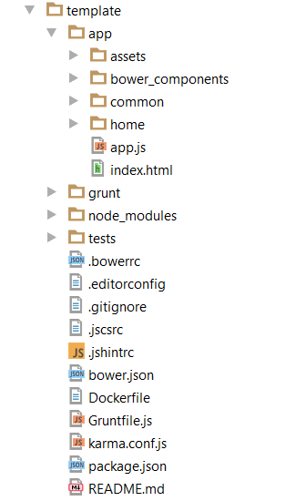

# DigitalEdge Visualization Template


##Introduction

The DigitalEdge Visualization Template provides a framework for integrating third party visualization libraries into a structured environment. The template utilizes AngularJS to provide an extensible, dynamic structure for application building. In addition to the application skeleton, a [D3](http://d3js.org/) bar chart visualization is included as an [example project](https://github.com/deleidos/de-visualization-angular-sdk-example) to showcase the template's flexibility, code conventions, and best practices. The blank template, in contrast, is thin and only loads a static webpage with the core angular components. To run the applications, you will be required to install the Grunt, NodeJS, and Bower task runners.

In the future, the template will expand to provide additional modules and external library support. Bootstraping any visualization or analytic app should not require decisions regarding architectural design or configuration. Rather, you should only need to focus on writing business logic.

##Getting Started

To begin using the template, download or clone the https://github.com/deleidos/de-visualization-angular-sdk.git project to your computer.

####Requirements

In order to actively run the template, you will need the following libraries installed on your machine:

1. [node](http://nodejs.org/)
2. [bower](http://bower.io/)
3. [grunt-cli](http://gruntjs.com/getting-started)

A basic understanding of angular.js (version 1.x) is necessary to utilize this template to its full potential. If you need angular training, we recommend [codeschool's AngularJS course.](http://campus.codeschool.com/courses/shaping-up-with-angular-js/intro)

####Install Dependencies

The template project requires external development tools and frontend framework code to operate correctly. The development tools include task runners and the karma testing suite while the front-end packages include bootstrap and angular, among others.

* Development tools are installed via `npm`, the node package manager. Tools are listed in package.json.
* Frontend code is installed via `bower`, a client-side code package manager. Front-end libraries are listed in bower.json.

Using a command shell, navigate to the location of the template project.

The template is preconfigured for `npm` to automatically run `bower` so we can simply execute:
```
npm install
```

<u>Note:</u>
The package.json file controls the npm installation. If you do not wish for npm to automatically install/update the bower components you can remove the following json object:

    "scripts": {
        "postinstall": "bower install"
    }


The project should now have two new folders named `node_modules` and `bower_components`.



Normally, the bower_components folder would be installed in the root directory. However, it is faster to serve the files if they are co-located in the 'app' folder with the other html. The installation location is determined by the .bowerrc file.

<u>Note:</u>
If the npm or bower install fails, check your network connections. You can run the npm install command as many times as necessary.

####Running the Application

The template was designed to use Grunt as an automated task runner. One of the tasks starts a local webserver for easier testing. Starting the server requires the command:
```
grunt serve
```
Grunt should automatically open the system's default browser and navigate to http://localhost:9000

The following page should appear:


####Docker Containerization

The DigitalEdge 3.0 platform was built with portability in mind. Therefore, all of the DigitalEdge 3.0 apps support docker containerization. For the visualization template, creating a container is as easy as executing an additional grunt command. The `docker_io` command will build a jetty docker container containing the dist/ folder contents. If a different web server is desired, the changes must be made in the Dockerfile.

There are two version of the `docker_io` command - "deploy" and "local". Before building a docker container using the "deploy" option, the grunt task `docker_io` must be configured with an appropriate push location.

1. Open Gruntfile.js
2. Navigate to line 69 (docker_io:deploy pushlocation)
3. Replace "der.deleidos.com" with your preferred location
4. Update the username on the next line for the new push location

To build a docker container, run the following commands:

```
npm install
grunt
grunt docker_io:deploy --tag=${TAG}
```
OR
```
npm install
grunt
grunt docker_io:local
```

If the --tag option is left off of the `grunt docker_io:deploy' command, the container will be labeled with the tag "latest".

<u>Note:</u>
Sudo may be required to run docker commands.

Learn more about docker at http://www.docker.com/

####Other Deployment Options

If you choose not to use docker containers, you can deploy the application to any webserver by moving the dist/ folder and its contents.

##Developing From The Template

DigitalEdge's visualization template was built to showcase a basic structure in order to provide a well formatted application and automate the build processes. When developing with this template, continue to follow the best practices laid out in the application. There is also an example project for comparison.

####Versioning

This template is listed as part of the DigitalEdge 3.0.0-beta release. This is the initial release for this template.

####Directory Guide

```
app/                          --> all of the source files for the application
  assets/                     --> any extra code or components not related to angular code
    css/                      --> stylesheets for the application
      app.css                 --> default stylesheet
    img/                      --> images for your application
    lib/                      --> library files not downloaded by bower
  common/                     --> components that could be used across modules
    common.module.js          --> module definition
    common.service.js         --> example service
    version.directive.js      --> example directive
  home/                       --> example component
    home.controller.js        --> controller for the homepage view
    home.html                 --> homepage view
    home.module.js            --> definition of the home module
    home.routes.js            --> route config for the home module
  app.js                      --> entry point to the app; sets up the main module
  index.html                  --> main html template file
grunt/                        --> additional grunt task configuration files
  docker_io.js                --> configuration for the docker_io grunt task
tests/                        --> unit tests for the application
  home/                       --> unit tests for the home component
    home.controller.spec.js   --> jasmine test file for the home controller
.bowerrc                      --> bower configuration
.editorconfig                 --> optional file that describes how an editor should be configured
.gitignore                    --> lists files to be ignored by git source control management
.jscsrc                       --> jscs configuration (see Grunt section below)
.jshintrc                     --> jshint configuration (see Grunt section below)
bower.json                    --> defines the bower module with dependencies
Dockerfile                    --> file that defines the docker configuration
Gruntfile.js                  --> grunt config file
karma.conf.js                 --> karma test config file
package.json                  --> defines the npm module with dependencies
README.md                     --> documentation file
```

####Modules/Functional Areas

#####Home
In the base template, the home directory is an example of a self-contained angular module or component of the webapp. Under the current configuration, the app will load and route to the home view by default.

The home module contains:

* A *.module.js file where a module is defined and dependencies are listed. This file is required to build a component.
* A *.routes.js file for the routing configuration of the module's views. If a component has one or more views, a route configuration file will be necessary.
* An html file partial that defines the layout of the page view. A component can have zero or more views in it.
* A *.controller.js file which adds logic to the view. Controllers should be thin and single purpose. There should be a one-to-one correspondence between controllers and views.

To create a new module, copy and paste the home directory, rename it, and choose the appropriate angular components. Any newly defined modules need to be added to app.js, and any new script files will have to be included in index.html.

#####Common

The common directory is a specialized module. The common module should only contain components that need to be shared. Components could include directives or services, or even common templates or partials that can be reused in different functional areas.

The common module contains:

* A *.module.js file which is necessary to define a new angular module.
* A *.service.js file which is an example of an angular service.
* A *.directive.js file which contains an example of an angular directive.

<u>Note:</u>
Not all services or directives need to be in the common area.

####Development Tools

#####Grunt

As previously mentioned, the DigitalEdge Visualization Template uses grunt as its main task runner. Pre-configured in the template are five tasks that complete common build procedures. These tasks are assembled from a collection of individual grunt tasks.

The included tasks are:

* grunt serve - Starts an http server on local host, serves the application, and opens a web browser. A file watcher is included and will refresh the application in the browser whenever a file is changed.
* grunt test - Runs unit tests in karma
* grunt check-code - Runs two tools against the code to check for potential errors and code style:
    * jshint - Checks all js files for code quality and will report any warnings or errors it finds. The configuration for jshint can be found in the .jshintrc file. Learn more about jshint at http://jshint.com
    * jscs - Checks all js files for code style as defined in the .jscsrc file and automatically fixes any errors it finds. Learn more about jscs at http://jscs.info/
* grunt build - Prepares code for production by concatenating and minifying all javascript app code. The result of this task is a dist/ folder that is placed at the root level of the project directory.
* grunt docker_io - Builds and pushes the docker container. For more information, see the "Docker Containerization" section above.

In addition to these tasks, there is a default task which runs `grunt check-code`, `grunt test`, and `grunt build` in order. The default task can be run by simply running the `grunt` command.

<u>Note:</u>
Grunt must be run from the same directory that Gruntfile.js is located.

<u>Note:</u>
Any individual grunt task can be run using `grunt <taskname>`

#####Bower

While Grunt is responsible for managing tasks, bower is responsible for downloading and installing client side dependencies. All of the required files and versions are stored in the bower.json file. Learn more about bower at [http://bower.io](http://bower.io).

Instead of adding script tags to external links, bower makes it easy to add libraries and  dependency to our application. Below are steps to add the time and date library, moment.js:

1. *(optional)* Search for moment in the bower registry by running `bower search moment`. The `bower search` command can be used
to search for any bower package in the registry. Alternatively, search for packages at [http://bower.io/search](http://bower.io/search).
2. Install moment by running `bower install moment --save`. The --save flag will automatically add the dependency to
bower.json.
3. Verify that the moment.js file was properly imported as a script into the index.html file (this is done automatically by bower and grunt).

Bower has been configured so that after an install, it will automatically add the script to the index.html file.

##Testing

Unit testing is at the core of angular, so the DigitalEdge Visualization Template was designed with testing in mind. Tests are built using the [Jasmine](http://jasmine.github.io/) testing framework, and they are run with the [Karma](http://karma-runner.github.io/0.13/index.html) test runner.

One example test is present in the tests/ folder. The home.controller.spec.js checks the webpage to see if the header says "Welcome!". The test will fail if the title is changed.

Running any test simply requires executing the following command from within the template directory:

`karma start karma.conf.js`

All of the testing configuration is housed in the `karma.conf.js` file. Note that you will need to add any new application files to the "files" section of the configuration in an appropriate loading order. Failure to do so may result in failing tests even though your code is correct.

Karma will start and temporarily open 4 browsers (Chrome, Firefox, Internet Explorer, and PhantomJS) and run the test code in each one, reporting any failures.

All test files naming conventions should follow \*.\*.spec.js. Currently there is no support for end-to-end testing.

<u>Note:</u>
Controllers are not the only angular components that can be tested - services and directives can (and should) be tested as well.

##Example Bar Chart Project

To showcase how the template can be utilized to build a visualization, the DigitalEdge team created a bar chart visualization example using D3. The example is located here: https://github.com/deleidos/de-visualization-angular-sdk-example

##Troubleshooting

##FAQ

##Maintainers

The DigitalEdge Visualization Template is managed by the DigitalEdge team. DigitalEdge is a product of Leidos, Inc.

11951 Freedom Drive
Reston, VA 20190

##License

The DigitalEdge Visualization Template is licensed for use under the Apache 2.0 license.
